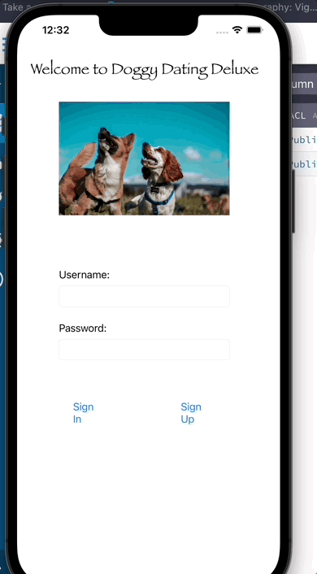

# DoggyDatingDeluxeIOS

## Table of Contents
1. [Overview](#Overview)
1. [Product Spec](#Product-Spec)
1. [Wireframes](#Wireframes)
1. [Schema](#Schema)

## Overview
### Description
Tracks where a dog is, and pairs them with others based on that location. Could be used as a dating app, or just meeting new dogs in the same area.

### App Evaluation
- **Category:** Social Networking
- **Mobile:** This app would be primarily developed for mobile but would perhaps be just as viable on a computer, such as tinder or other similar apps.
- **Story:** Analyzes users music choices, and connects them to other users with similar choices. The user can then decide to message this person and befriend them if wanted.
- **Market:** Any individual could choose to use this app, and to keep it a safe environment.
- **Habit:** This app could be used as often or unoften as the user wanted depending on how deep their social life is, and what exactly they're looking for.
- **Scope:** First we would start with pairing people based on music taste, then perhaps this could evolve into a music sharing application as well to broaden its usage. Large potential for use with spotify, apple music, or other music streaming applications.

## Product Spec
### 1. User Stories 

* [] A User will be able to login to application.
* [] User can select between multiple navigation items.
* [] A new user may create a profile.
* [] A user may post an image.
* [] A user may view a collection of posts.
* [] A user may view a collection of their own posts


### Stretch Stories 
* [] The Botton Navigation will have a custom design.
* [] The Signup Functionality will be done via button on Login page
* [] A user will be able to create a blog.
* [] A user will be able to post their location.
* [] Users with close locations will be matched.
* [] Users will be able to delete their account.

### 2. Screen Archetypes

* Login 
* Register - User signs up or logs into their account
* Messaging Screen - Chat for users to communicate
   * Upon selecting location choice users matched and message screen opens
* Profile Screen 
   * Allows user to upload a photo and fill in information that is interesting to them and others
* Match Screen
   * Gives the user permission to match the similar locations or to decline.

### 3. Navigation

**Tab Navigation** (Tab to Screen)

* Profile
* Location
* Settings


**Flow Navigation** (Screen to Screen)
* Log-in -> Account creation if no log in is available
* Profile -> Text field to be modified. 
* Location -> 

## Wireframes
<br>


### Interactive Prototype
<br>


## Schema 
### Models
#### Post

   | Property      | Type     | Description |
   | ------------- | -------- | ------------|
   | objectId      | String   | unique id for the user post (default field) |
   | author        | Pointer to User| image author |
   | image         | File     | image that user posts |
   | caption       | String   | image caption by author |
 
#### User

   | Property      | Type     | Description |
   | ------------- | -------- | ------------|
   | objectId      | String   | unique id for the user post (default field) |
   | emailVerified | boolean  | Check user email status |
   | username      | String   | a online username for any given user |
   | password      | String   | a password to protect a user's account |
   | email         | String   |a user's email, used for account recovery|
   
 
                                         
                                         
                                         
### Networking
#### Screen Requests
   - Home Feed Screen
      - (Read/GET) Query all posts where user is author
         ```swift
         let query = PFQuery(className:"Post")
         query.whereKey("author", equalTo: currentUser)
         query.order(byDescending: "createdAt"
               print(error.localizedDescription)
            } else if let posts = posts {
               print("Successfully retrieved \(posts.count) posts."
            }
         }
       
   
      - (Create/POST) Create a new comment on a post
     
   - Create Post Screen
      - (Create/POST) Create a new post object
   - Profile Screen
      - (Read/GET) Query logged in user object
      - (Update/PUT) Update user profile image


   HTTP Verb | Endpoint | Description
   ----------|----------|------------
    `GET`    | /characters | get all characters
    `GET`    | /characters/?name=name | return specific character by name
    
 

   HTTP Verb | Endpoint | Description
   ----------|----------|------------
    `GET`    | /cities | gets all cities
    `GET`    | /cities/byId/:id | gets specific city by :id
    `GET`    | /continents | gets all continents
    `GET`    | /continents/byId/:id | gets specific continent by :id
    `GET`    | /regions | gets all regions
    `GET`    | /regions/byId/:id | gets specific region by :id
    `GET`    | /characters/paths/:name | gets a character's path with a given name
